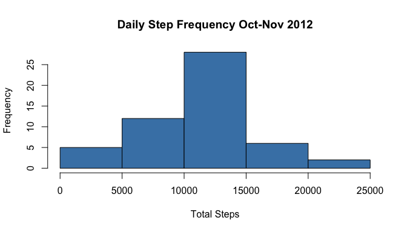
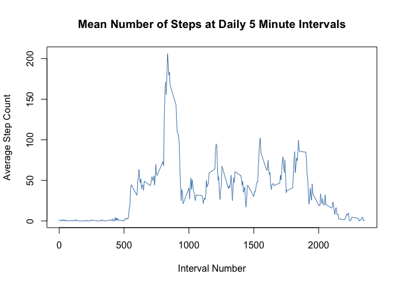
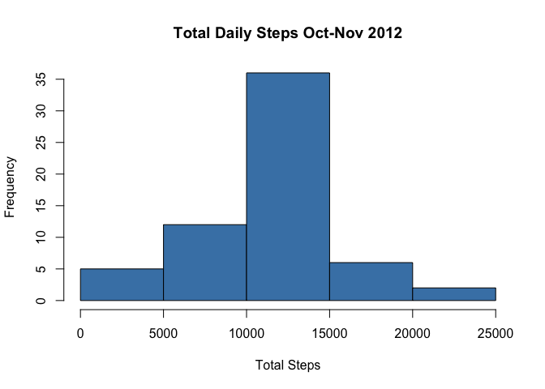
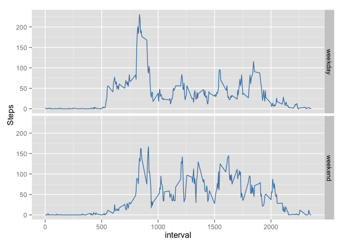

# Reproducible Research: Peer Assessment 1

  
  


#### Data from a personal activity monitoring device has been collected at 5 minute intervals throughout the day for a single person  during the months of October and November, 2012.  In this report the data is explored for overall total step counts, patterns across distinct 5-minute intervals in a day, and differences between weekdays and weekends.  
  
 
<p style = "color: steelblue; font-size: 12pt"> First, we'll read the data (activity.csv) in and add a column (Date) as a date type.</p>  


```r
      library(lubridate)

      activity <- read.csv("activity.csv")
      activity$Date <- ymd(activity$date)
```

<p style = "color: steelblue; font-size: 12pt">  Let's look at the mean total number of steps taken per day.  The histogram shows the distribution of total steps across all days.  The mean and median of the daily totals are calculated. </p>


```r
      library(dplyr)
```

```
## 
## Attaching package: 'dplyr'
## 
## The following objects are masked from 'package:lubridate':
## 
##     intersect, setdiff, union
## 
## The following objects are masked from 'package:stats':
## 
##     filter, lag
## 
## The following objects are masked from 'package:base':
## 
##     intersect, setdiff, setequal, union
```

```r
      dailySteps <- activity %>%
            group_by(Date) %>% 
            summarise(totalSteps = sum(steps)) 

      hist(dailySteps$totalSteps, main= "Daily Step Frequency Oct-Nov 2012", xlab="Total Steps", col="steelblue")
```

 

```r
      mean <- mean(dailySteps$totalSteps, na.rm=TRUE)
      median <- median(dailySteps$totalSteps, na.rm=TRUE)
      
      cat("The mean is ", mean, "\n", sep="")
```

```
## The mean is 10766.19
```

```r
      cat("The median is ", median, "\n", sep="")
```

```
## The median is 10765
```
<p style = "color: steelblue; font-size: 12pt"> Now we'll look at the average daily activity pattern.  The data has been averaged for each interval to find the interval with the highest step count. </p>  


```r
      intervalSteps <- activity %>%
            group_by(interval) %>% 
            summarise(avgSteps = mean(steps, na.rm=TRUE)) 

      plot(intervalSteps$interval, intervalSteps$avgSteps, type="l", main="Mean Number of Steps at Daily 5 Minute Intervals", 
           xlab ="Interval Number", ylab = "Average Step Count", col="steelblue")
```

 

```r
      maxInterval <- subset(intervalSteps,(grepl(max(intervalSteps$avgSteps),intervalSteps$avgSteps)))

      cat("The Interval with the highest step count is ", maxInterval[1,1], "\n", sep="")
```

```
## The Interval with the highest step count is 835
```
<p style = "color: steelblue; font-size: 12pt"> Next we'll explore missing values (NA) by taking a count of observations that do not have a step count reported.  Then we'll replace all missing values with the mean value calculated for the interval across all days.</p>  

<p style = "color: steelblue; font-size: 12pt"> The histogram showing the distribution of total steps across all days is displayed again with the imputed missing values. Mean and median for total daily steps are calculated once more with the new dataset. </p>  


```r
      cat("The number of observations that are missing is ", sum(is.na(activity$steps)), "\n", sep="")
```

```
## The number of observations that are missing is 2304
```

```r
            activity2 <- activity
            for (i in 1:nrow(activity2))    {
                  if (is.na(activity2[i,1]))  {
                        thisInterval <- activity2[i,3]
                        thisIntervalRow <- intervalSteps[intervalSteps$interval==thisInterval,]
                        activity2[i,1] <- thisIntervalRow[1,2]
                  }

                  
            }
            
            dailySteps2 <- activity2 %>%
            group_by(Date) %>% 
            summarise(totalSteps = sum(steps)) 

            hist(dailySteps2$totalSteps, main= "Total Daily Steps Oct-Nov 2012", xlab="Total Steps", col="steelblue")
```

 

```r
                  mean <- mean(dailySteps2$totalSteps, na.rm=TRUE)
                  median <- median(dailySteps2$totalSteps, na.rm=TRUE)

                  cat("The mean with imputed values is ", mean, "\n", sep="")
```

```
## The mean with imputed values is 10766.19
```

```r
                  cat("The median with imputed values is ", median, "\n", sep="")
```

```
## The median with imputed values is 10766.19
```
<p style = "color: steelblue; font-size: 12pt"> Finally we'll look for differences in activity patterns on weekdays versus weekend days.</p>  


```r
      library(ggplot2)
      
      activity2$dayOfWeek <- ifelse(((wday(activity2$Date) == 1) | (wday(activity2$Date) == 7)), "weekend", "weekday")

      intervalSteps2 <- activity2 %>%
            group_by(dayOfWeek, interval) %>% 
            summarise(Steps = mean(steps, na.rm=TRUE))       

      ggplot(intervalSteps2, aes(x = interval, y = Steps)) +  geom_line(colour="steelblue") + facet_grid(dayOfWeek~.)
```

 

